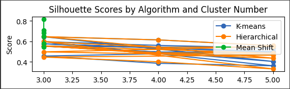
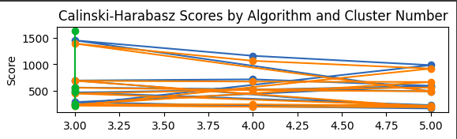
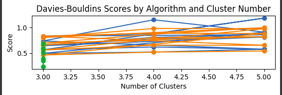

# Clustering

# Clustering
# Clustering Algorithms Comparative Study

## Introduction
This project compares the performance of K-Means, Hierarchical, and Mean Shift clustering algorithms on the Iris dataset using different preprocessing techniques and evaluation metrics.

## Dataset
Used the Iris dataset from UCI repository with 150 samples and 4 features.

## Methodology
1. Applied 6 preprocessing techniques:
   - No processing
   - Normalization
   - Standardization
   - PCA
   - Standardization + Normalization
   - Standardization + Normalization + PCA
2. Applied 3 clustering algorithms:
   - K-Means
   - Hierarchical
   - Mean Shift
3. Evaluated with 3 metrics:
   - Silhouette Score
   - Calinski-Harabasz Score
   - Davies-Bouldin Score

## Results

### Performance Tables
Silhouette Table:
|                                         |        3 |          4 |          5 |
|:----------------------------------------|---------:|-----------:|-----------:|
| ('Hierarchical', 'No Data Processing')  | 0.554324 |   0.488967 |   0.484383 |
| ('Hierarchical', 'Using Normalization') | 0.556232 |   0.479108 |   0.465668 |
| ('Hierarchical', 'Using PCA')           | 0.598475 |   0.540977 |   0.548784 |
| ('Hierarchical', 'Using T+N')           | 0.497641 |   0.476814 |   0.436102 |
| ('Hierarchical', 'Using T+N+PCA')       | 0.646757 |   0.614649 |   0.557788 |
| ('Hierarchical', 'Using Transform')     | 0.446689 |   0.400636 |   0.330587 |
| ('K-means', 'No Data Processing')       | 0.552819 |   0.496517 |   0.493944 |
| ('K-means', 'Using Normalization')      | 0.576326 |   0.537454 |   0.501903 |
| ('K-means', 'Using PCA')                | 0.597676 |   0.560957 |   0.535393 |
| ('K-means', 'Using T+N')                | 0.554713 |   0.495032 |   0.403868 |
| ('K-means', 'Using T+N+PCA')            | 0.645394 |   0.614649 |   0.557061 |
| ('K-means', 'Using Transform')          | 0.456634 |   0.38578  |   0.361357 |
| ('Mean Shift', 'No Data Processing')    | 0.685788 | nan        | nan        |
| ('Mean Shift', 'Using Normalization')   | 0.819244 | nan        | nan        |
| ('Mean Shift', 'Using PCA')             | 0.710311 | nan        | nan        |
| ('Mean Shift', 'Using T+N')             | 0.546956 | nan        | nan        |
| ('Mean Shift', 'Using T+N+PCA')         | 0.649255 | nan        | nan        |
| ('Mean Shift', 'Using Transform')       | 0.58175  | nan        | nan        |

Calinski-Harabasz Table:
|                                         |        3 |        4 |       5 |
|:----------------------------------------|---------:|---------:|--------:|
| ('Hierarchical', 'No Data Processing')  |  558.058 |  515.079 | 488.485 |
| ('Hierarchical', 'Using Normalization') | 1386.78  | 1063.77  | 917.203 |
| ('Hierarchical', 'Using PCA')           |  688.618 |  673.946 | 665.883 |
| ('Hierarchical', 'Using T+N')           |  242.267 |  245.718 | 218.639 |
| ('Hierarchical', 'Using T+N+PCA')       |  449.144 |  522.115 | 562.466 |
| ('Hierarchical', 'Using Transform')     |  222.719 |  201.251 | 192.681 |
| ('K-means', 'No Data Processing')       |  561.628 |  530.39  | 492.512 |
| ('K-means', 'Using Normalization')      | 1447     | 1157.35  | 982.041 |
| ('K-means', 'Using PCA')                |  693.708 |  715.903 | 595.471 |
| ('K-means', 'Using T+N')                |  288.676 |  218.324 | 231.559 |
| ('K-means', 'Using T+N+PCA')            |  468.13  |  522.115 | 589.525 |
| ('K-means', 'Using Transform')          |  241.316 |  206.791 | 168.884 |
| ('Mean Shift', 'No Data Processing')    |  509.703 |  nan     | nan     |
| ('Mean Shift', 'Using Normalization')   | 1634     |  nan     | nan     |
| ('Mean Shift', 'Using PCA')             |  565.734 |  nan     | nan     |
| ('Mean Shift', 'Using T+N')             |  215.354 |  nan     | nan     |
| ('Mean Shift', 'Using T+N+PCA')         |  481.721 |  nan     | nan     |
| ('Mean Shift', 'Using Transform')       |  251.349 |  nan     | nan     |

Davies-Bouldin Table:
|                                         |        3 |          4 |          5 |
|:----------------------------------------|---------:|-----------:|-----------:|
| ('Hierarchical', 'No Data Processing')  | 0.656256 |   0.795264 |   0.820417 |
| ('Hierarchical', 'Using Normalization') | 0.693809 |   0.868267 |   0.994574 |
| ('Hierarchical', 'Using PCA')           | 0.560496 |   0.654624 |   0.652573 |
| ('Hierarchical', 'Using T+N')           | 0.828864 |   0.889194 |   0.880079 |
| ('Hierarchical', 'Using T+N+PCA')       | 0.463699 |   0.520675 |   0.541163 |
| ('Hierarchical', 'Using Transform')     | 0.803467 |   0.978821 |   0.974249 |
| ('K-means', 'No Data Processing')       | 0.661972 |   0.770613 |   0.812958 |
| ('K-means', 'Using Normalization')      | 0.644248 |   0.806385 |   0.858188 |
| ('K-means', 'Using PCA')                | 0.564816 |   0.619713 |   0.576688 |
| ('K-means', 'Using T+N')                | 0.736454 |   1.14755  |   0.90819  |
| ('K-means', 'Using T+N+PCA')            | 0.495941 |   0.520675 |   0.575881 |
| ('K-means', 'Using Transform')          | 0.832277 |   0.876703 |   1.18028  |
| ('Mean Shift', 'No Data Processing')    | 0.388552 | nan        | nan        |
| ('Mean Shift', 'Using Normalization')   | 0.240689 | nan        | nan        |
| ('Mean Shift', 'Using PCA')             | 0.355059 | nan        | nan        |
| ('Mean Shift', 'Using T+N')             | 0.689363 | nan        | nan        |
| ('Mean Shift', 'Using T+N+PCA')         | 0.515777 | nan        | nan        |
| ('Mean Shift', 'Using Transform')       | 0.593313 | nan        | nan        |

### Key Findings
1. **Best Algorithm**: [Your observation]
2. **Best Preprocessing**: [Your observation]
3. **Optimal Cluster Number**: [Your observation]

## Visualizations
## Results

### Silhouette Scores

### Calinski-Harabasz Scores

### Davies-Bouldin Scores

## Conclusion
## Key Findings

- **Mean Shift** performed best overall:
  - Highest Silhouette = `0.819`  
  - Lowest Davies-Bouldin = `0.241` (with normalization)  
  - Auto-detects clusters (less control)

- **K-Means (3 clusters + T+N+PCA)** was the top configurable method:
  - Silhouette = `0.649`  
  - Davies-Bouldin = `0.516`  

- **Cluster Count Insight**:  
  `3 clusters` consistently outperformed 4–5 clusters, matching the Iris dataset's natural structure.
